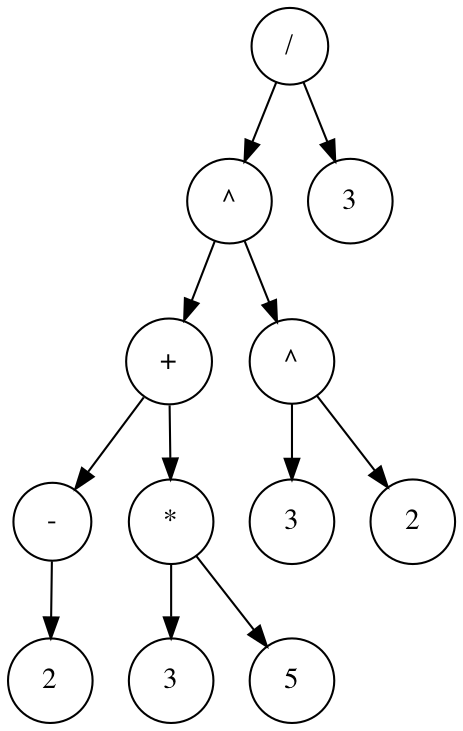

This is a simple LL(1) parser for inflix arithmetic expression. It supports:

- integer literals (`[0-9]+`)
- operators `+`, `-`, `*`, `/`, and `^` (power of)
- negation (`1--1`)
- parantheses
- operator precedence
- operator associativity (`^` is right-associative, while the rest are left-associative)

## Grammar

```
expr ::= addSubExpr

addSubExpr ::= mulDivExpr addSubExprTail

addSubExprTail ::= ('+' | '-') mulDivExpr addSubExprTail
                 | empty

mulDivExpr ::= powExpr mulDivExprTail

mulDivExprTail ::= ('*' | '/') powExpr mulDivExprTail
                 | empty

powExpr ::= parenExpr powExprTail
          | '-' parenExpr

powExprTail ::= '^' parenExpr powExprTail
              | empty

parenExpr ::= '(' expr ')'
            | INTLIT

INTLIT ::= ['0'..'9']+
```

## Usage

`expr [-dot ast.dot] <expr>`

Example:

```sh
$ go run main.go "1+2+3"
6

$ go run main.go "((-2+3*5)^3^2)/3"
3534833124
```

If `-dot` flag is provided, the abstract syntax tree is output as a dot file. Example AST for the expression `((-2+3*5)^3^2)/3`:


